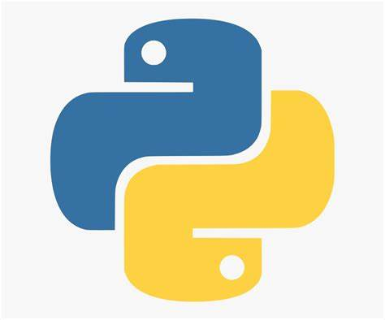

## Data Analytics

### Analytical Tools

**What is this?** Below are recreations of some of the statistical tools I created in 2022 to perform multivariate analysis and A/B testing of biomarker data. These tools were generated in Python to generate and validate hypotheses and to support statistical/clinical teams in finding new leads. 

As an example, I used a <a href="https://www.kaggle.com/datasets/gregorut/videogamesales">Kaggle dataset of video game sales</a> to explore any meaningful insights among the top video game publishers. I used <a href="https://www.kaggle.com/budincsevity/szeged-weather">another Kaggle dataset</a> to show the relationship between weather and humidity in Szeged, Hungary. All plots were created from scratch using matplotlib and the seaborn library in Python. 
<i>Certain features have been stripped to prevent exposure of proprietary/restricted material</i>

<table>
  <tr>
    <td></td>
    <td></td>
  </tr>
 </table>

<table>
   <tr>
     <td></td>
     <td></td>
     <td></td>
  </tr>
 </table>

In 2022, I worked with the neuro-biomarker team at Janssen and had the opportunity to author my first paper. Click the link below to view the 2022 ECTRIMS abstract. The full publication will release late 2023.

<a href="https://journals.sagepub.com/doi/epub/10.1177/13524585221123687"><i>Datta, R., & Kirksey, D. (2022). Preservation of myelin in patients with relapsing multiple sclerosis treated with ponesimod compared to teriflunomide. Multiple Sclerosis Journal, 632.</i></a>

### Lab Metrics and QC

**What is this?** With the introduction of Ancestry DNA Health and a large scale-up in manufacturing throughput, a small team was put together to validate new metrics, investigate lab anomolies, and to track the overall health and quality of our laboratory operations. Welcome to my dashboard. In my experience working with both the front and backends of lab management, I've been afforded the opportunity to implemenent new processes, introduce new equipment, design new quality standards, and developing new validation protocols to the company's existing manufacturing workflows and SOPs.

Lorem ipsum dolor sit amet, consectetur adipiscing elit, sed do eiusmod tempor incididunt ut labore et dolore magna aliqua. Ut enim ad minim veniam, quis nostrud exercitation ullamco laboris nisi ut aliquip ex ea commodo consequat. Duis aute irure dolor in reprehenderit in voluptate velit esse cillum dolore eu fugiat nulla pariatur. Excepteur sint occaecat cupidatat non proident, sunt in culpa qui officia deserunt mollit anim id est laborum.

**Why?** Clinical solutions! New workflows mean new quality metrics. Introduction of a new clinical assay means it's time to dive deeper into any existing quality control metrics to see what new quality standards our inplace lab processes may need. Nonconformances provide a basis for further data collection and standard investigations.

### Dashboards

I attended WeWork's <i>Intermediate/Advanced Tableau Visualization Training</i> in 2019. Take a look at some of my work:

**Project description:** Below are examples of data mining using Python, R, T-SQL, and Tableau to rank nonconformances among different laboratory conditions. Python was used to group affected sample batches and map them to each experimental condition using Pandas and Scikit-learn. Grouped data were then tested for concordance and mapped to several equipment run conditions. 

### Jupyter Notebooks

Click the icon below to see examples data mining I conducted to kickstart this dashboard. I use MS SQL Server and Python's pandas library for data cleaning and exploratory analysis, Python's scikit-learn library for machine learning, and Python's matplotlib and seaborn libraries for visualization. For more information, visit my Tableau site at -----.

<i>Any Personally-Indentifiable or Protected Health Information has been removed to ensure fair-use. </i>

