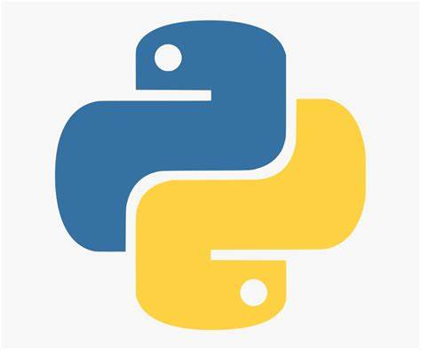

## Data Analytics

### Business Analytics

**What is this?** With the introduction of Ancestry DNA Health and a large scale-up in manufacturing throughput, a small team was put together to validate new metrics, investigate lab anomolies, and to track the overall health and quality of our laboratory operations. Welcome to my dashboard. In my experience working with both the front and backends of lab management, I've been afforded the opportunity to implemenent new processes, introduce new equipment, design new quality standards, and develop new validation protocols to the company's existing manufacturing workflows and SOPs.

**Why?** Clinical solutions! New workflows means new quality metrics. Introduction of a new clinical assay means it's time to dive deeper into any existing quality control metrics to see what new quality standards our inplace lab processes may need. Nonconformances provide a basis for further data collection and standard investigations.

**Projects**

### Jupyter Notebooks

Click the icon below to see examples of data mining I conducted in 2018 to kickstart above dashboard. I used MS SQL Server and Python's pandas library for data cleaning and exploratory analysis, Python's scikit-learn library for machine learning, and Python's matplotlib and seaborn libraries for visualization. For more information, visit my Tableau site (link above).

<i>Any Personally-Indentifiable or Protected Health Information has been removed to ensure fair-use. </i>
