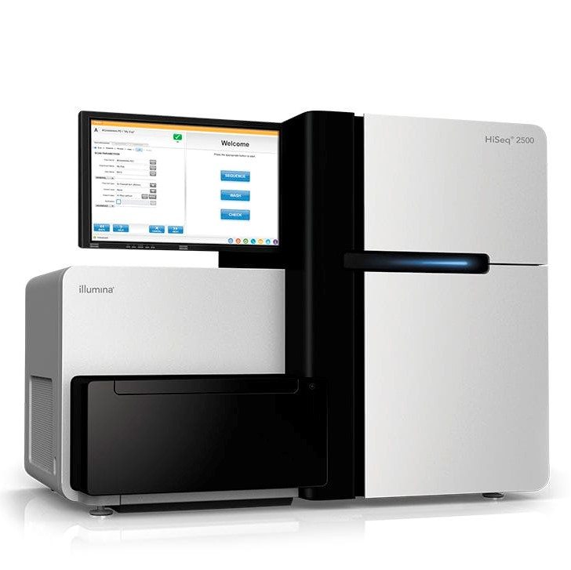
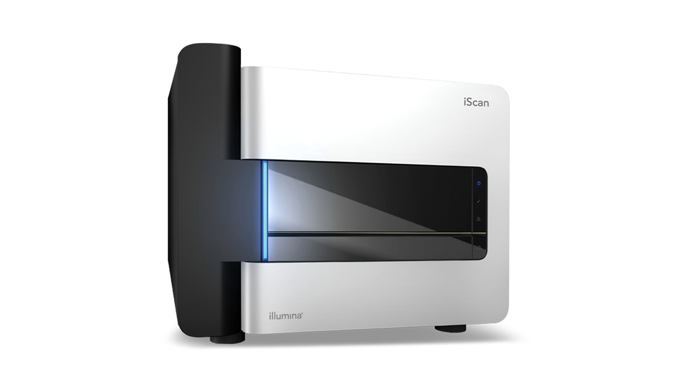
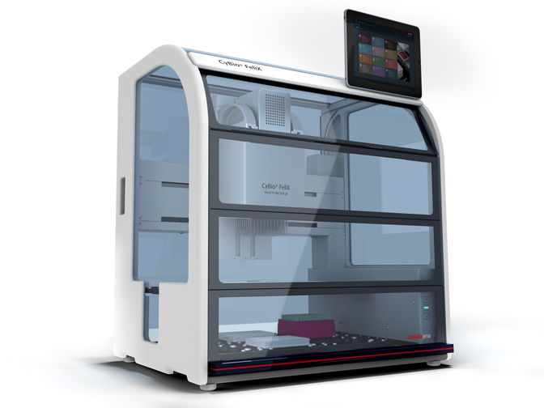

## Laboratory Work

### Background

Working in lab management, I had the benefit of automating and managing a host of laboratory equipment. My time there gave me the opportunity to attend onsite trainings for the Hamilton STAR liquid-handling models, as well as training for the Tecan Freedom EVO platform to repair on-deck components, and I have received certifications for both. 

I have experience scripting several microarray assays, including Illumina's Infinium and enrichment BeadArray assays on both the Tecan and Hamilton STAR, and I have a wealth of experience in LIMS integration and parameter tracking. My process normally includes building requirements to fit the needs of our lab users. Once the parameters are set, I can begin developing workflows by creating manual sequences and new libraries to supplement any lab method and fit these metrics for LIMS tracking. Sequence data can be tracked and edited, and I make sure to keep my scripts modularized for subsequent import. 

A few of my projects include: 
<ul>
  <li>BeadPool Manufacturing</li>
  <li>Illumina's Infinium pharmacogenetics assay (Excalibur)</li>
  <li>Development of enrichment method to Illumina's Razorfish automated assay</li>
  <li>ADNA Health (Feasibility)</li>
  <li>Illumina's Nighthawk and Razorfish+ assays</li>
</ul>

<b>Certifications:</b> <i>Hamilton MICROLAB VENUS Software Traning I #VST119.11; Tecan EvoWare Liquid Standard Standard Software Training I </i>
 
 
<b>Equipment:</b> Though most of my experience lies in liquid-handler automation, my background lies primarily in method development, process improvement, and PQ/IQ/OQ tasks; In my time at Illumina, I've gained a fair amount of experience managing a wide variety of laboratory equipment, including fragment analyzers, bioanalyzers, and laser scanners. I have some familiarity with Archimedes scanners and extensive experience with iScans. In my time as an Automation Engineer, I took the time to create an engineering quality manual to outline my progress and to develop the role for future hires. In addition to defining quality standards, the manual includes various tools for method development and revising SOPs, user trainings, service contracts, reference manuals, and other resources for asset management.
 
<table>
  <tr style="height:75%">
    <td></td>
    <td></td>
    <td></td>
  </tr>
  </table>
 

<i> Above (left to right): HiSeq 2500, iScan, CyBio FeliX </i>
 
 
<b>Development:</b> I create a deck layout using the liquid handling platform, add manual sequences, import the libraries, then BAM! From there, I can develop the protocol using new submethods and push any tracked data to the LIMS. Sequence data can be tracked and edited; I can then modularize my workflows for a subsequent import.

I attended the Eppendorf Automation Summit in 2019. There I learned several lab-based platforms to fit various user needs. Using this knowledge, I used this knowledge to lead a project in late 2020 to automate Illumina's sample prep sequencing platform via the Cybio FeliX. I also attended a 2021 Webinar on process development and its challenges/developments in the vaccine industry.
 
### References
<b>Equipment manuals:</b> 
 
<b>iScan:</b> <i>https://support-docs.illumina.com/ARR/iScan/Content/ARR/FrontPages/iscan.htm</i>
 
<b>Illumina LIMS:</b>  <i>https://support.illumina.com/content/dam/illumina-marketing/documents/products/datasheets/datasheet_lims.pdf</i>
 
<b>Hamilton STAR:</b>  <i>https://www.illumina.com/content/dam/illumina-support/documents/documentation/system_documentation/mlstar/hamilton-ml-star-reference-guide-15070074-a.pdf</i>
 
<b>NGS Library Prep</b> https://www.illumina.com/techniques/sequencing/ngs-library-prep/dna.html

